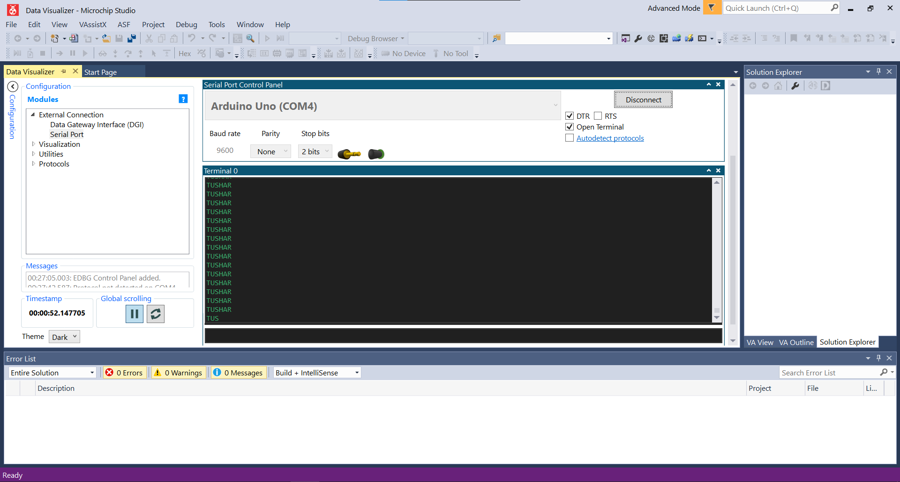

# UART
Simple Assembly program to Transmit a string stored in the flash memory at 9600 baud rate infinitely.  
  
   

  
  
*Open MICROCHIP Studio -> File -> Open -> Project/Solution -> uart.atsln*
